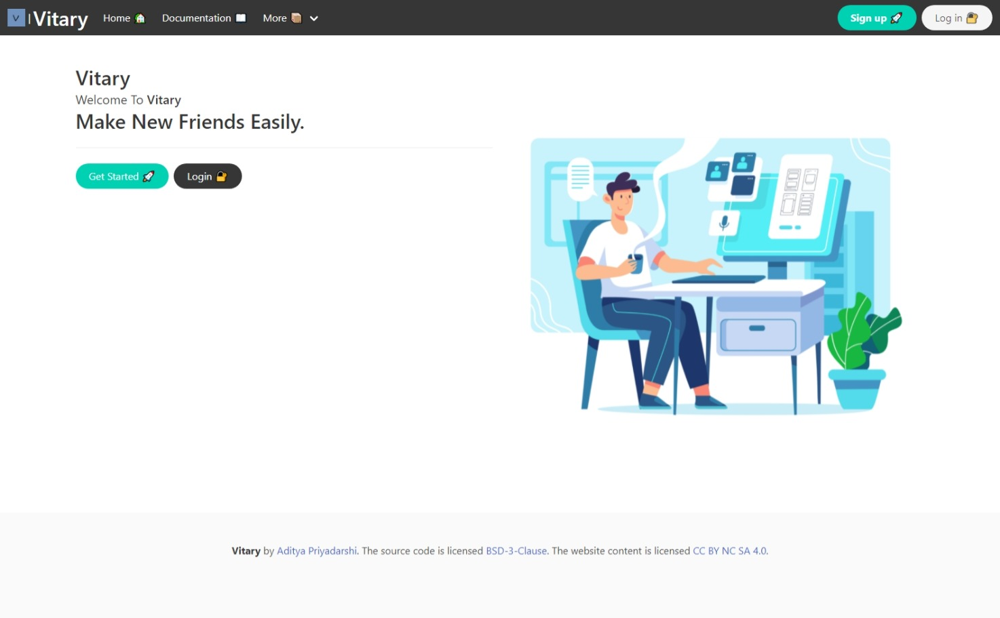
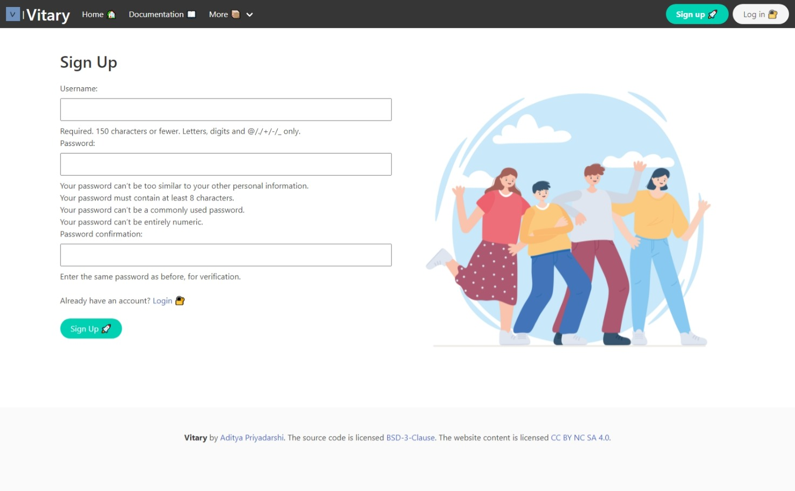
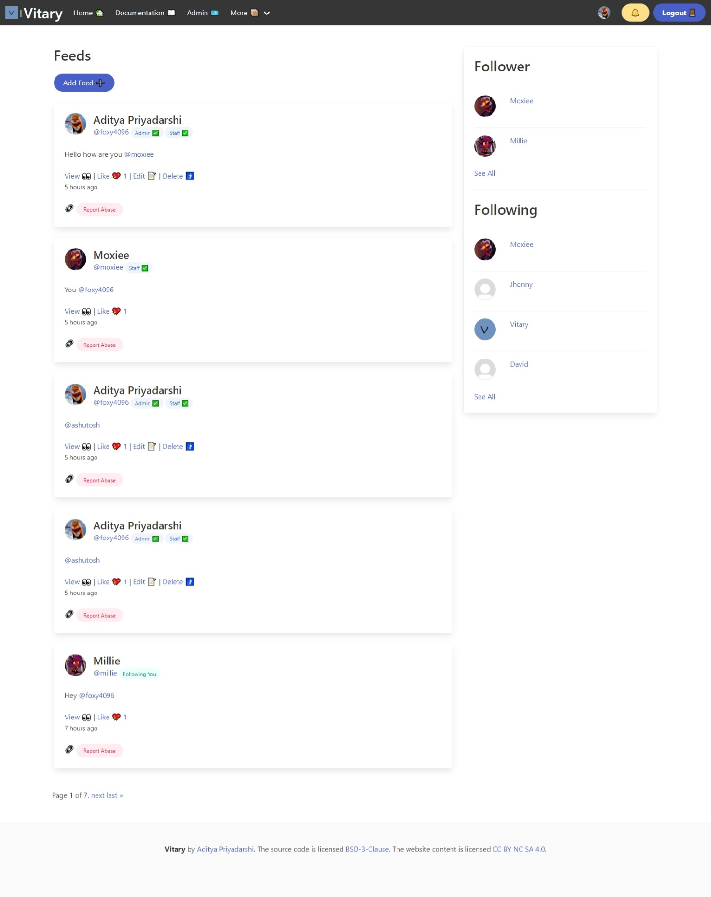
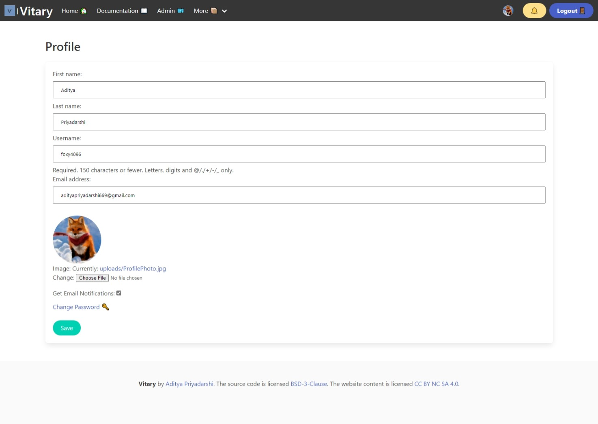

# Vitary 
A simple social media made with Django

## Installation :hammer_and_wrench:	

Get the source code 💻

```
git clone https://github.com/foxy4096/Vitary.git
```

Get the Google Drive JSON key 

[Get it from here](https://django-googledrive-storage.readthedocs.io/en/latest/)

And rename the json key to `GDSTORAGE_JSON.json` and put it in the `BASE_DIR/Vitary/`


Go the the dir 📁

```
cd Vitary
```

Add the enviroment variables :gear:

In Powershell or terminal 💻

```
touch .env
```

In `.env` add the following variables ➕

```
DEFAULT_FROM_EMAIL # Add your production email address
DEBUG # True or False
GDJSON = True
GDSJSON_KEY_FILE_CONTENTS = "" # Empty string
```


Make a virtualenv 📡

```
pip install virtualenv
```

and

```
virtuatenv venv
```

Install the dependencies 🔨

```
pip install -r req.txt
```

Make Migrations 💿

On Windows:
```
python manage.py makemigrations
```

On *nix systemm:
```
python3 manage.py makemigrations
```

Migrate the database 🏃‍♂️

On Windows:
```
python manage.py migrate
```

On *nix systemm:
```
python3 manage.py migrate
```

Create the superuser 🤵

On Windows :
```
python manage.py createsuperuser
```

On *nix systemm:
```
python3 manage.py createsuperuser
```

Run the server 🚀

On Windows:
```
python manage.py runserver
```

On *nix systemm:
```
python3 manage.py runserver
```

<hr>

## Tools 🔧 

[Python](https://python.org) the programming language

[Git](http://git-scm.com) Version Control System

[Visual Studio Code](https://code.visualstudio.com) Free source code editor

## Screenshot :camera:









