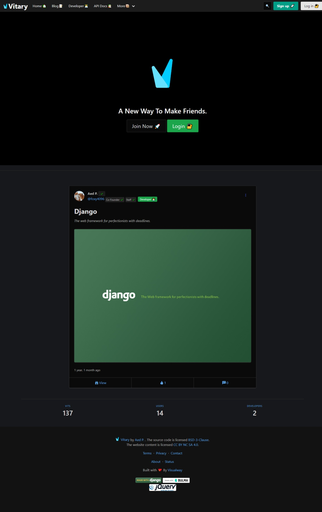
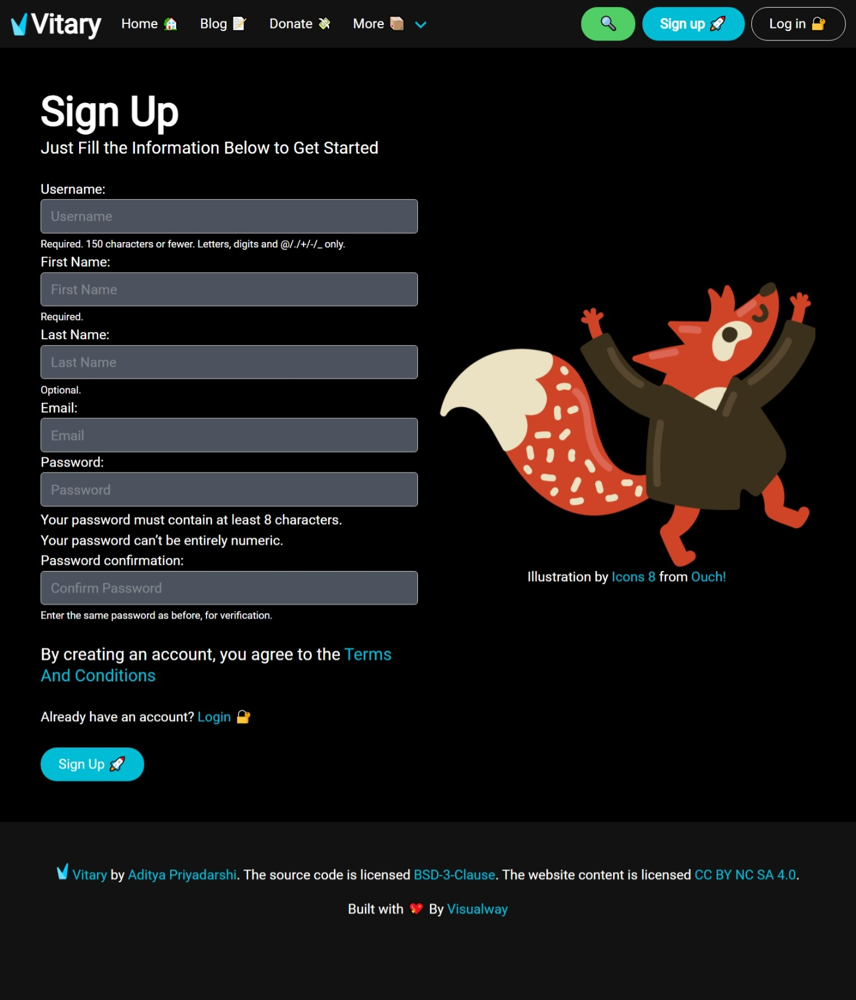
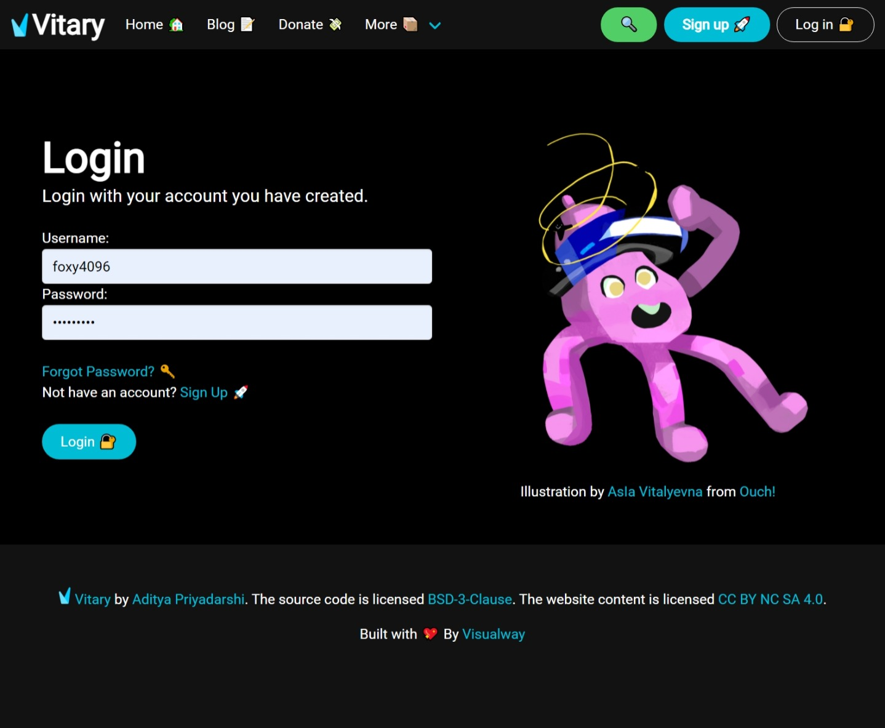
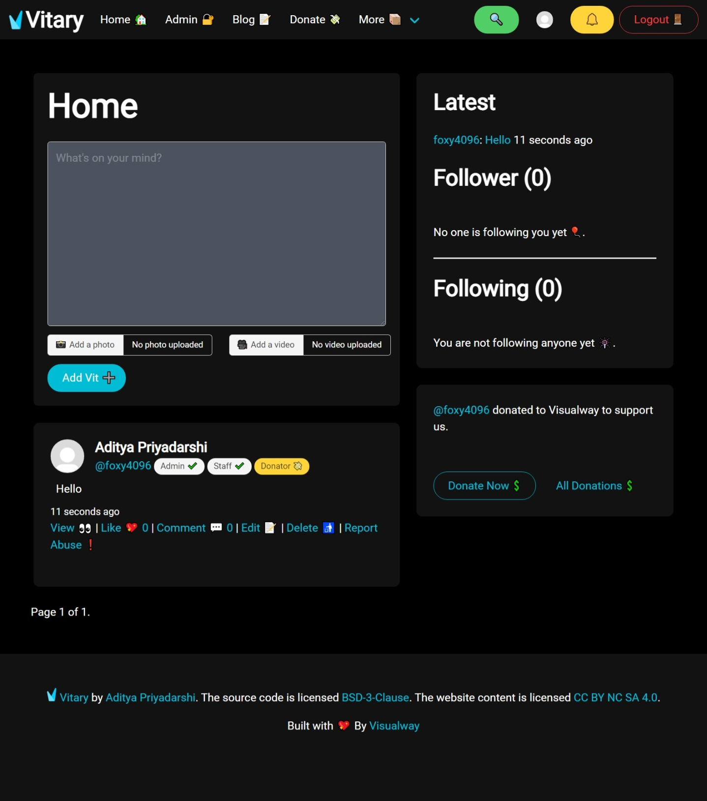
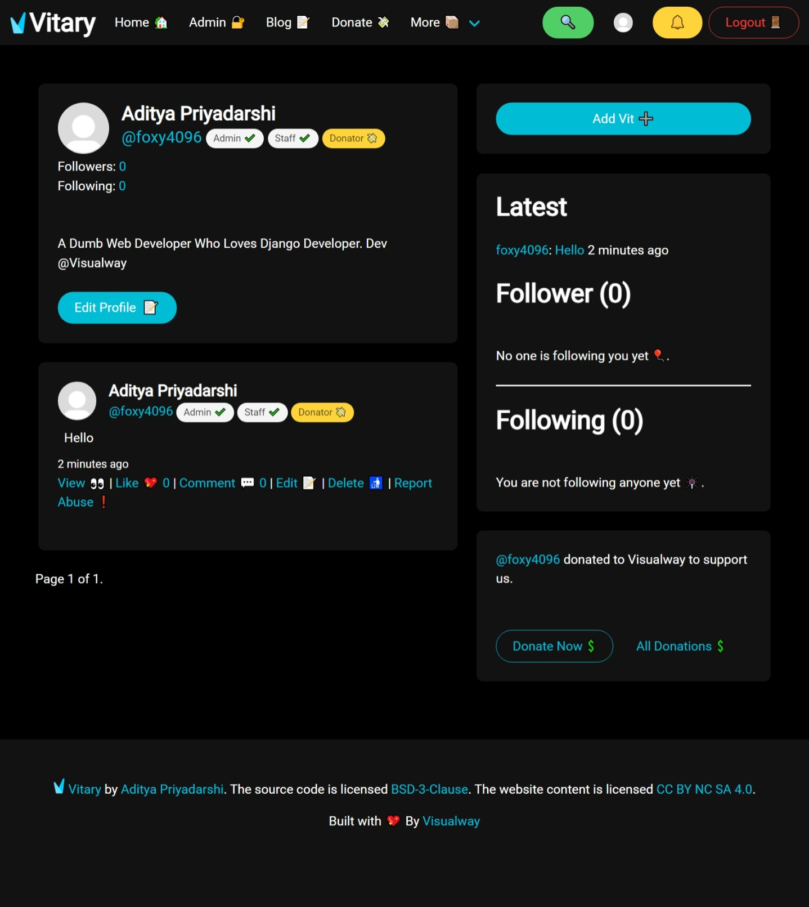

# Vitary

A simple social media made with Django

[](https://github.com/foxy4096/Vitary/actions/workflows/codeql-analysis.yml)

## Installation :hammer_and_wrench:

Get the source code 💻

```
git clone https://github.com/foxy4096/Vitary.git
```

Go the the dir 📁

```
cd Vitary
```

Add the enviroment variables :gear:

In Powershell or terminal 💻

```
touch Vitary/.env
```

In `.env` add the following variables ➕

```
DEBUG=True or False
EMAIL_ADDRESS [Optional if DEBUG is True]
EMAIL_PASSWORD [Optional if DEBUG is True]
SITE_ID [Optional if DEBUG is True]
SECURE_SSL_REDIRECT (Bool) [Optional if DEBUG is True]
CSRF_COOKIE_SECURE (Bool) [Optional if DEBUG is True]
STRIPE_PUBLIC_KEY
STRIPE_SECRET_KEY
```

Get the Google Drive JSON key from [Here](https://django-googledrive-storage.readthedocs.io/en/latest/)

Rename it to `GOOGLE_DRIVE_KEY_FILE.json` and Put it in the Base Directory (At the ame level where the `manage.py` is located)

Make a virtualenv 📡

```
pip install virtualenv
```

and

```
virtualenv venv
```

Install the dependencies 🔨

```
pip install -r req.txt
```

Make Migrations 💿

On Windows:

```
python manage.py makemigrations
```

On \*nix systemm:

```
python3 manage.py makemigrations
```

Migrate the database 🏃‍♂️

On Windows:

```
python manage.py migrate
```

On \*nix systemm:

```
python3 manage.py migrate
```

Create the superuser 🤵

On Windows :

```
python manage.py createsuperuser
```

On \*nix systemm:

```
python3 manage.py createsuperuser
```

Run the server 🚀

On Windows:

```
python manage.py runserver
```

On \*nix systemm:

```
python3 manage.py runserver
```

<hr>

## Tools 🔧

[Python](https://python.org) the programming language

[Git](http://git-scm.com) Version Control System

[Visual Studio Code](https://code.visualstudio.com) Free source code editor

## Screenshot :camera:










